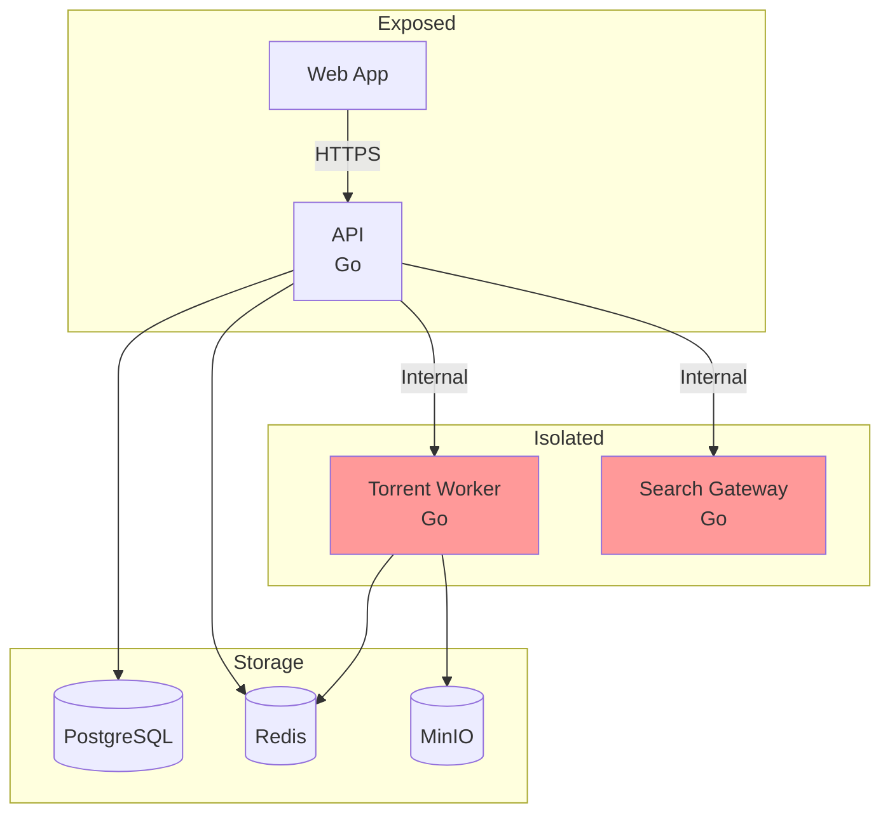

# dotslashstream

Self-hosted media streaming service. Stream while downloading.

## Overview

dotslashstream plays content as it downloads using HLS transcoding. Built for personal use with family and friends.

## Documentation

| Document | Description |
|----------|-------------|
| [architecture.md](./architecture.md) | System design, network isolation, security |
| [services.md](./services.md) | Service breakdown and responsibilities |
| [streaming.md](./streaming.md) | Transcoding pipeline and profiles |
| [storage.md](./storage.md) | Object storage architecture |

## Quick Glance

## Key Features

- **Stream while downloading** — no wait for full download
- **Network isolation** — workers have no internet access
- **HLS transcoding** — adaptive bitrate streaming
- **Optional saving** — choose to archive or stream-only
- **Format selection** — 1080p, 720p, 480p options
- **Flexible input** — search indexers or paste magnet links
- **Movies & TV shows** — with season/episode hierarchy
- **Object storage** — S3-compatible bucket storage
- **Indexer isolation** — separate search gateway
- **Self-hosted** — run on your own hardware
- **3 concurrent downloads** per user limit

## Tech Stack

| Component | Technology |
|-----------|------------|
| API | Go + net/http |
| Torrent Worker | Go + anacrolix/torrent |
| Search Gateway | Go + Colly |
| Web Frontend | Vue + Vite |
| Database | PostgreSQL |
| Task Queue | Asynq (Redis) |
| Object Storage | MinIO (S3) |
| Video Player | HLS.js |

