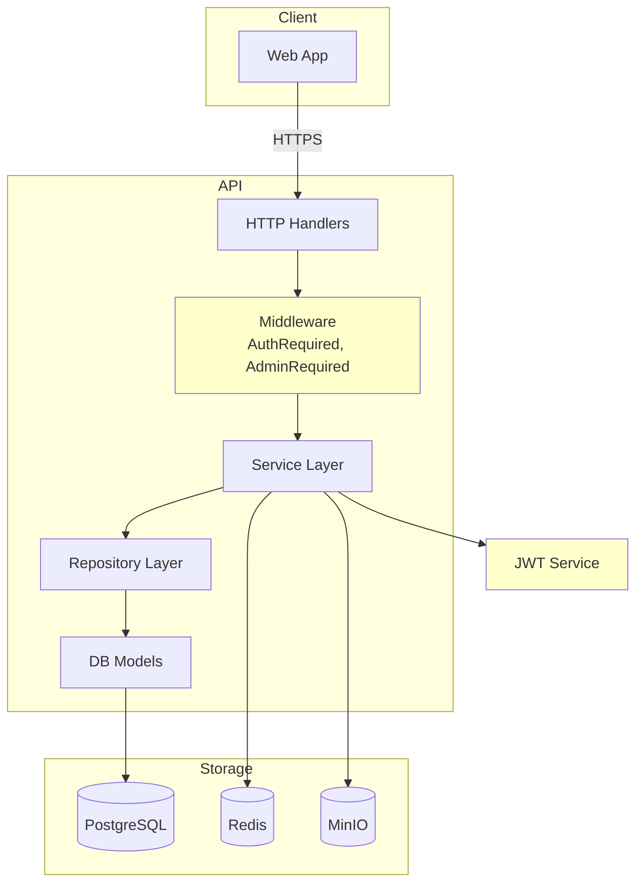

# API

Go REST API built on `net/http` + Bun ORM. Single external entry point for all client communication.

## Documentation

| Document | Description |
|----------|-------------|
| [auth.md](./auth.md) | Authentication, JWT, middleware, invite system |
| [settings.md](./settings.md) | Admin-only global application settings |
| [migrations.md](./migrations.md) | SQL migrations, safety model, production workflow |

## Project Structure

```
apps/api/
├── cmd/
│   ├── api/
│   │   └── main.go                    # Entry point, signal handling
│   └── migrate/
│       └── main.go                    # Migration CLI (up/down/status/create)
├── internal/
│   ├── app/
│   │   ├── app.go                     # Wires deps, starts server, shutdown
│   │   ├── config.go                  # Env parsing (caarlos0/env)
│   │   ├── handlers.go                # HandlerInit — wires services/repos
│   │   ├── middleware.go              # Global sanitized request logging
│   │   └── registry.go                # Route registration (RouteRegistrar interface)
│   ├── auth/
│   │   ├── handler.go                 # HTTP handlers (route handlers)
│   │   ├── helpers.go                 # Password hashing, JSON response utils
│   │   ├── jwt.go                     # JWT sign/verify (HS256)
│   │   ├── jwt_test.go               # JWT unit tests
│   │   ├── middleware.go             # AuthRequired, AdminRequired decorators
│   │   ├── repos.go                   # UserRepo, InviteRepo interfaces
│   │   ├── service.go                # Auth business logic
│   │   ├── service_test.go           # Service unit tests (mocked repos)
│   │   └── types.go                   # Request/response structs
│   ├── httpx/
│   │   └── response.go                # Shared JSON response helpers
│   ├── settings/
│   │   ├── handler.go                 # Admin-only GET/PATCH /settings
│   │   ├── repos.go                   # Settings repository interface
│   │   ├── service.go                 # Defaults and update logic
│   │   └── types.go                   # Public settings document
│   ├── repo/
│   │   ├── base.go                    # Generic CRUD (Go generics)
│   │   ├── invite.go                  # Invite usage tracking
│   │   ├── settings.go                # Singleton global-settings persistence
│   │   └── user.go                    # User-specific queries
│   └── platform/
│       ├── bucket.go                  # BucketClient interface
│       ├── database.go               # DatabaseClient interface
│       ├── queue.go                   # QueueClient interface
│       ├── postgres/
│       ├── driver.go             # Bun + pgdriver, runs migrations on startup
│       ├── helpers.go            # Embedded migration runner
│       ├── migrations/
│       │   ├── 000001_create_users/
│       │   │   ├── metadata.json
│       │   │   ├── up.sql
│       │   │   └── down.sql
│       │   ├── 000002_create_invites/
│       │   │   ├── metadata.json
│       │   │   ├── up.sql
│       │   │   └── down.sql
│       │   └── 000003_create_settings/
│       │       ├── metadata.json
│       │       ├── up.sql
│       │       └── down.sql
│       ├── registry.go           # Auto-generated model table list
│       └── models/
│       │       ├── invite.go          # Invite table schema
│       │       ├── settings.go        # Global settings singleton schema
│       │       └── user.go            # User table schema
│       ├── redis/
│       │   └── driver.go             # Asynq + go-redis
│       └── minio/
│           └── driver.go             # MinIO S3 client
├── tests/                             # Python e2e tests (stdlib only)
│   ├── __main__.py                    # Entry: python3 -m tests
│   ├── client.py                      # HTTP client, helpers
│   ├── runner.py                      # Test runner, assertions
│   └── auth/                          # Auth endpoint coverage
│       ├── test_health.py
│       ├── test_register.py
│       ├── test_login.py
│       ├── test_refresh.py
│       ├── test_change_password.py
│       ├── test_invite.py
│       └── test_edge_cases.py
│   └── settings/
│       └── test_settings.py           # Admin settings and signup-policy coverage
├── scripts/
│   └── gen_registry.py               # Auto-generate registry.go from models
├── Dockerfile                         # Production multi-stage build
├── Dockerfile.dev                     # Dev image with Air hot reload
├── docker-compose.yml                 # Dev stack: api + postgres + redis
├── .air.toml                          # Air hot reload config
├── .dockerignore
├── Makefile                           # Dev commands
└── go.mod
```

## Configuration

Copy `.env.example` to `.env` and fill in your values. The server reads from `.env` automatically.

| Variable | Required | Default | Description |
|----------|----------|---------|-------------|
| `DB_DSN` | ✅ | — | PostgreSQL connection string |
| `REDIS_ADDRESS` | ✅ | — | Redis host:port |
| `BUCKET_ADDRESS` | ✅ | — | MinIO host:port |
| `BUCKET_KEY_ID` | ✅ | — | MinIO access key ID |
| `BUCKET_ACCESS_KEY` | ✅ | — | MinIO secret access key |
| `HMAC_SECRET` | ✅ | — | JWT signing secret (HS256) |
| `PORT` | — | `8080` | Server listen port |
| `USE_SSL` | — | `false` | TLS for MinIO connection |

## Quick Start

```bash
# Dev environment with hot reload
make dev

# Or run locally
make run

# Run all tests
make test          # Go unit tests
make test-e2e      # Python e2e tests (requires running API)

# Full CI pipeline
make ci
```

## Database

Bun ORM with PostgreSQL. Schema managed by SQL migrations embedded in the binary. Pending migrations run automatically on startup.

### Models

| Model | Table | Key Fields |
|-------|-------|------------|
| User | `users` | UUID v7 PK, username, email, password_hash, salt, is_admin |
| Invite | `invites` | UUID v7 PK, token_hash, max_uses, uses, created_by |
| Settings | `settings` | Singleton row, allow_signup_without_invite |


### Migrations

Folder-per-migration with `metadata.json` (author, description, `safe` flag). Embedded in binary, auto-applied on startup.

- `safe: true` → runs on every startup
- `safe: false` → skipped unless `MIGRATE_UNSAFE=true`

```bash
make migration-list            # List all migrations with metadata
make migrate                   # Run pending migrations
make migrate-down              # Rollback last applied
make migrate-create name=add_foo desc="Add foo table"
make migrate-create-unsafe name=drop_bar desc="Drop bar table"
```

See [Migrations](migrations.md) for the full guide.

### Generic Repository

Base CRUD via `BaseRepository[T, P]` (Go generics):

```go
repo.NewBaseRepository[models.User, *models.User](db)
```

Provides: `Create`, `FindByID`, `FindAll`, `Update`, `Delete`.

Concrete repos embed the base and add domain-specific queries.

### Adding a New Model

1. Create struct in `internal/platform/postgres/models/` with `bun:"table:..."` tag
2. Run `make registry` to regenerate `registry.go`
3. Table is auto-created on next startup

## Testing

### Go Unit Tests

Colocated with source in `internal/auth/`:

```bash
make test           # all
make test-v         # verbose
make test-race      # race detector
make test-cover     # coverage report
```

### Python E2E Tests

Zero-dependency (stdlib only) tests against a running API:

```bash
make test-e2e                                         # seed admin + run all tests
python3 -m tests                                      # run tests after make seed
python3 -m tests auth/test_login.py                   # single file
python3 -m tests settings/test_settings.py            # settings edge cases
python3 -m tests settings/test_settings.py::test_admin_toggles_signup_policy
API_URL=http://localhost:9090 make test-e2e            # custom URL
```

## Docker

### Development

```bash
make dev          # build + start with hot reload
make dev-d        # detached mode
make dev-logs     # tail API logs
make dev-down     # stop
```

Hot reload via [Air](https://github.com/air-verse/air) — edits to `.go` files auto-rebuild and restart.

### Production

```bash
make prod-build   # build image
make prod-run     # run with .env file
```

## Makefile Commands

| Command | Description |
|---------|-------------|
| `make help` | Show all commands |
| `make build` | Build binary |
| `make run` | Run server |
| `make test` | Go unit tests |
| `make test-e2e` | Python e2e tests |
| `make test-race` | Tests with race detector |
| `make test-cover` | Coverage report |
| `make vet` | go vet |
| `make lint` | staticcheck |
| `make registry` | Regenerate model registry |
| `make tidy` | Tidy go.mod |
| `make ci` | Full CI: registry + tidy + vet + test-race |
| `make dev` | Docker dev with hot reload |
| `make prod-build` | Docker production build |
| `make db-shell` | psql shell |
| `make db-psql SQL="..."` | Quick query |

## Architecture



## Dependencies

| Package | Purpose |
|---------|---------|
| `github.com/golang-jwt/jwt/v5` | JWT signing/verification |
| `github.com/uptrace/bun` | ORM |
| `github.com/uptrace/bun/driver/pgdriver` | PostgreSQL driver |
| `github.com/caarlos0/env/v11` | Env config parsing |
| `github.com/google/uuid` | UUID v7 generation |
| `golang.org/x/crypto` | bcrypt password hashing |
| `github.com/hibiken/asynq` | Task queue (Redis) |
| `github.com/minio/minio-go/v7` | S3-compatible object storage |
