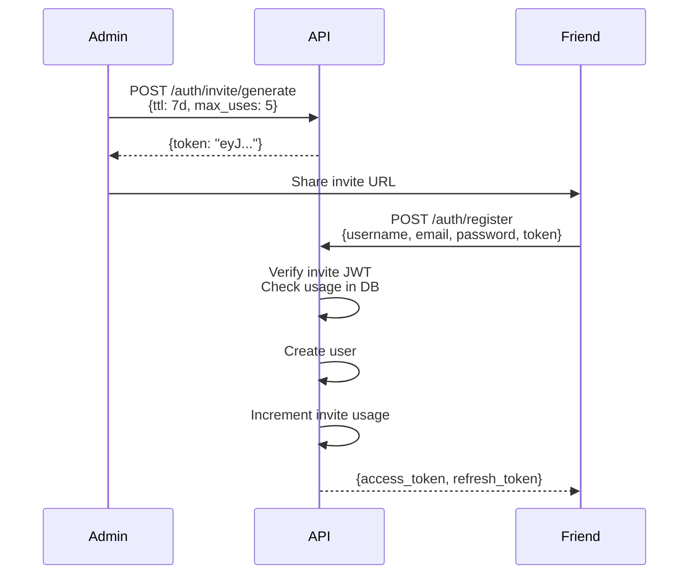

# Authentication

JWT-based auth with bcrypt password hashing, invite system for controlled access.

## File Layout

```
internal/auth/
├── handler.go       # Route registration + HTTP handlers
├── helpers.go       # Password hashing, writeJSON, writeError
├── jwt.go           # JWT sign/verify (HS256)
├── jwt_test.go      # JWT unit tests
├── middleware.go     # AuthRequired, AdminRequired decorators
├── repos.go         # UserRepo, InviteRepo interfaces
├── service.go       # Business logic
├── service_test.go  # Service unit tests (mocked repos)
└── types.go         # Request/response structs
```

## Endpoints

| Method | Path | Auth | Description |
|--------|------|------|-------------|
| `POST` | `/auth/register/admin` | — | Create first admin (only before init) |
| `POST` | `/auth/register` | — | Create account (invite required when open signup is disabled) |
| `POST` | `/auth/login` | — | Returns access + refresh tokens |
| `POST` | `/auth/refresh` | — | Exchange refresh token for new pair |
| `POST` | `/auth/change-password` | 🔒 | Update password (requires old) |
| `POST` | `/auth/invite/generate` | 🔒👑 | Create invite link (admin only) |

🔒 = `AuthRequired` middleware — valid Bearer token required
👑 = `AdminRequired` middleware — `is_admin` must be true

## Init Protocol

`POST /auth/register/admin` creates the **first admin user** without authentication. This endpoint is only available before the system is initialized (`first_init_completed = false` in settings).

- No auth required — this is the only unauthenticated admin-creation path
- Creates user with `is_admin = true` automatically
- Atomically sets `first_init_completed = true` after success
- Permanently returns `404` once initialized
- Request body: `{username, email, password}`

```json
// POST /auth/register/admin
{
  "username": "admin",
  "email": "admin@dotslashstream.local",
  "password": "admin123"
}

// 201 Created
{
  "access_token": "eyJ...",
  "refresh_token": "eyJ..."
}
```

## Signup Policy

`allow_signup_without_invite` controls invite enforcement. Default is `true` to preserve open signup and allow first-admin bootstrap. Admins update it through [settings.md](./settings.md).

- `true`: registration may omit `invite`
- `false`: registration without `invite` returns `403`
- Provided invite tokens are always verified and consumed after successful registration

## Middleware

Route protection via decorator chaining at registration time:

```go
// Public
mux.HandleFunc("POST /auth/register", h.register)
mux.HandleFunc("POST /auth/login", h.login)

// Authenticated
mux.Handle("POST /auth/change-password",
    AuthRequired(h.svc, http.HandlerFunc(h.changePassword)))

// Admin
mux.Handle("POST /auth/invite/generate",
    AuthRequired(h.svc, AdminRequired(http.HandlerFunc(h.generateInvite))))
```

Middleware stores user in context. Handlers retrieve via `UserFromContext(r)`.

## Request / Response Examples

### Register

```json
// POST /auth/register
{
  "username": "alice",
  "email": "alice@example.com",
  "password": "secretpass",
  "invite": "eyJ..."            // optional
}

// 201 Created
{
  "access_token": "eyJ...",
  "refresh_token": "eyJ..."
}
```

### Login

```json
// POST /auth/login
{
  "username": "alice",
  "password": "secretpass"
}

// 200 OK
{
  "access_token": "eyJ...",
  "refresh_token": "eyJ..."
}
```

### Refresh

```json
// POST /auth/refresh
{
  "refresh_token": "eyJ..."
}

// 200 OK
{
  "access_token": "eyJ...",
  "refresh_token": "eyJ..."
}
```

### Change Password

```json
// POST /auth/change-password
// Header: Authorization: Bearer <token>
{
  "old_password": "secretpass",
  "new_password": "newsecretpass"
}

// 200 OK
{
  "message": "password updated"
}
```

### Generate Invite (Admin)

```json
// POST /auth/invite/generate
// Header: Authorization: Bearer <token>
{
  "ttl": "168h",
  "max_uses": 5
}

// 201 Created
{
  "token": "eyJ...",
  "expires_at": "2026-08-02T00:00:00Z",
  "max_uses": 5
}
```

## Tokens

### Access Token

- **TTL:** 15 minutes
- **Payload:** `user_id`
- **Issuer:** `dotslashstream`

### Refresh Token

- **TTL:** 7 days
- **Purpose:** Obtain new access token without re-login

### Invite Token

- **TTL:** Configurable (e.g. 7 days)
- **Payload:** `inviter_id`, `max_uses`
- **Issuer:** `dotslashstream-invite`
- **Stateless:** JWT carries all metadata
- **Usage tracking:** SHA-256(token) → `invites` table

## Password Storage

```
password + random(16 bytes) → bcrypt(salted, cost=10)
```

- Salt: 16 random bytes, stored alongside hash
- Algorithm: bcrypt (cost 10)
- Verification: prepend stored salt → bcrypt compare

## Invite Flow



### Invite Lifecycle

1. **Generate** — Admin creates token with expiry + usage limit
2. **Distribute** — Share URL with friends
3. **Verify** — Check JWT validity + DB usage count before registration
4. **Consume** — Atomic use increment after successful registration
5. **Exhaust** — Token rejected when uses >= max_uses

## Error Responses

| Error | Status | Meaning |
|-------|--------|---------|
| `missing or malformed authorization header` | 401 | No Bearer token |
| `token expired` | 401 | Access token TTL exceeded |
| `invalid token` | 401 | Malformed or wrong-secret token |
| `authentication required` | 401 | Middleware: no user in context |
| `admin access required` | 403 | User `is_admin` is false |
| `invalid username or password` | 401 | Bad credentials |
| `username or email already taken` | 409 | Duplicate on register |
| `invite has expired` | 403 | Token TTL exceeded |
| `invite has no remaining uses` | 403 | Usage limit reached |
| `invalid invite token` | 403 | Token not found or malformed |
| `not found` | 404 | Init route after system is initialized |

## User Model

```sql
CREATE TABLE users (
    id           UUID PRIMARY KEY,        -- UUID v7 (time-ordered)
    username     TEXT NOT NULL UNIQUE,
    email        TEXT NOT NULL UNIQUE,
    password_hash BYTEA NOT NULL,
    salt         BYTEA NOT NULL,
    is_admin     BOOLEAN NOT NULL DEFAULT FALSE,
    created_at   TIMESTAMPTZ NOT NULL DEFAULT NOW(),
    updated_at   TIMESTAMPTZ NOT NULL DEFAULT NOW()
);
```

## Service Interface

```go
type Service struct {
    jwt        *JWTService
    userRepo   UserRepo
    inviteRepo InviteRepo
}

// Registration
Register(ctx, username, email, password) (*User, error)
RegisterAdmin(ctx, username, email, password) (*User, error)

// Login
Login(ctx, username, password) (accessToken, refreshToken string, err error)

// Token management
Refresh(ctx, refreshToken) (newAccess, newRefresh string, err error)
GetUserFromToken(ctx, token) (*User, error)

// Password
ChangePassword(ctx, userID, oldPassword, newPassword) error

// Invites
CreateInvite(ctx, inviterID, ttl, maxUses) (token string, err error)
VerifyInvite(ctx, token) (*InviteClaims, error)
ConsumeInvite(ctx, token) error
```

## JWT Structure

### Auth Claims

```json
{
  "user_id": "0192e4f8-...",
  "iss": "dotslashstream",
  "iat": 1700000000,
  "exp": 1700000900
}
```

### Invite Claims

```json
{
  "inviter_id": "0192e4f8-...",
  "max_uses": 5,
  "iss": "dotslashstream-invite",
  "iat": 1700000000,
  "exp": 1700604800
}
```

## Configuration

| Variable | Description |
|----------|-------------|
| `HMAC_SECRET` | Signing key for all JWT tokens |
