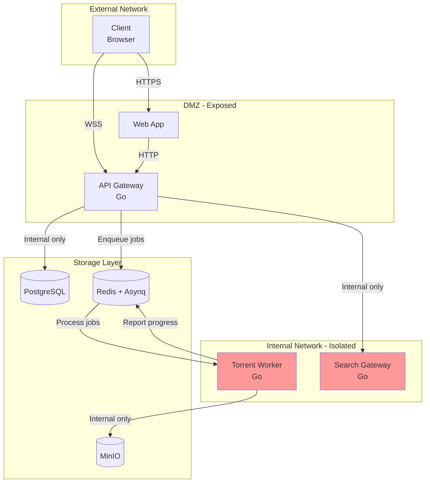
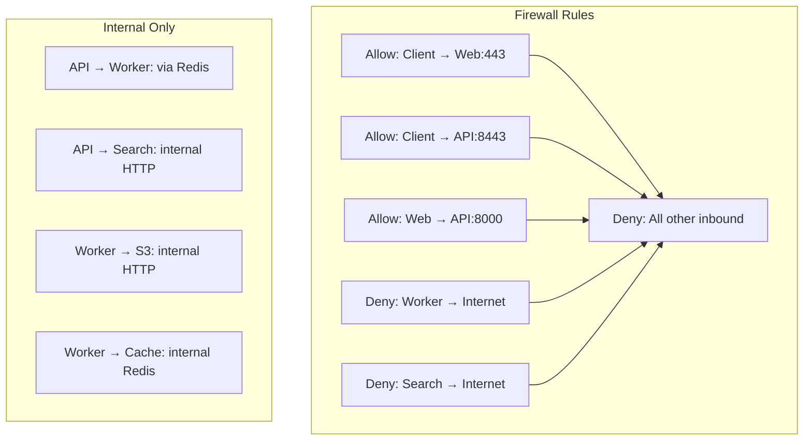
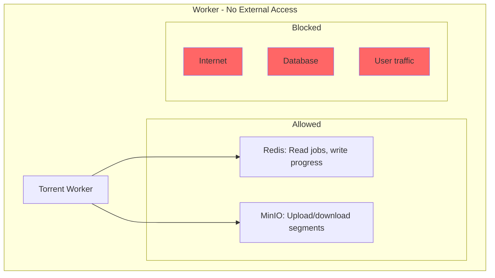
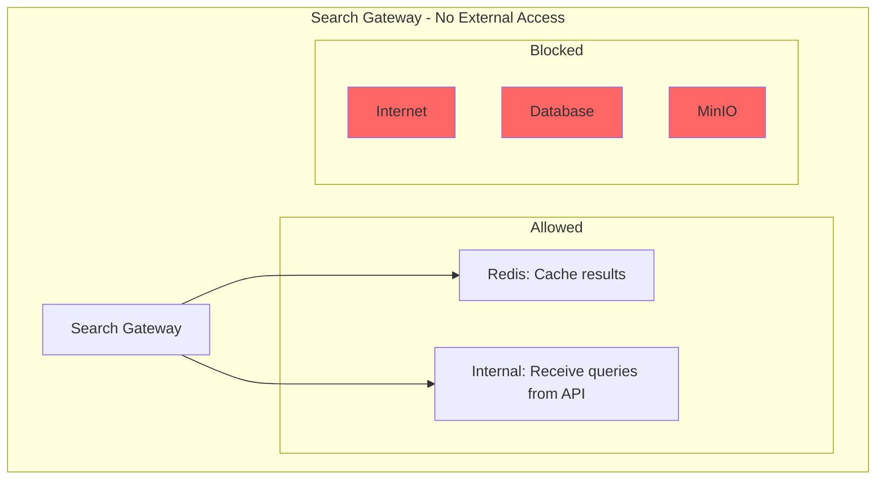
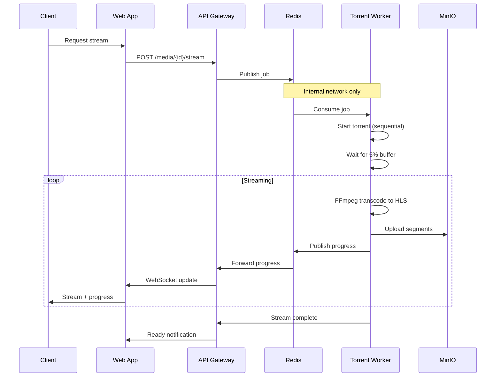
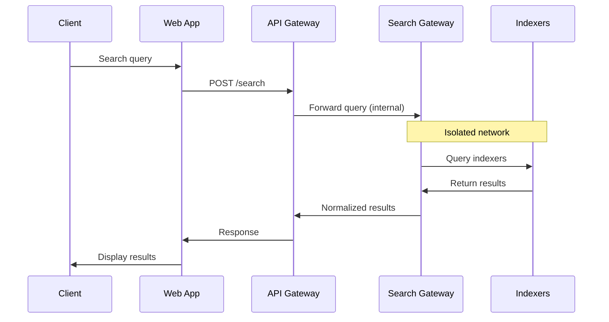
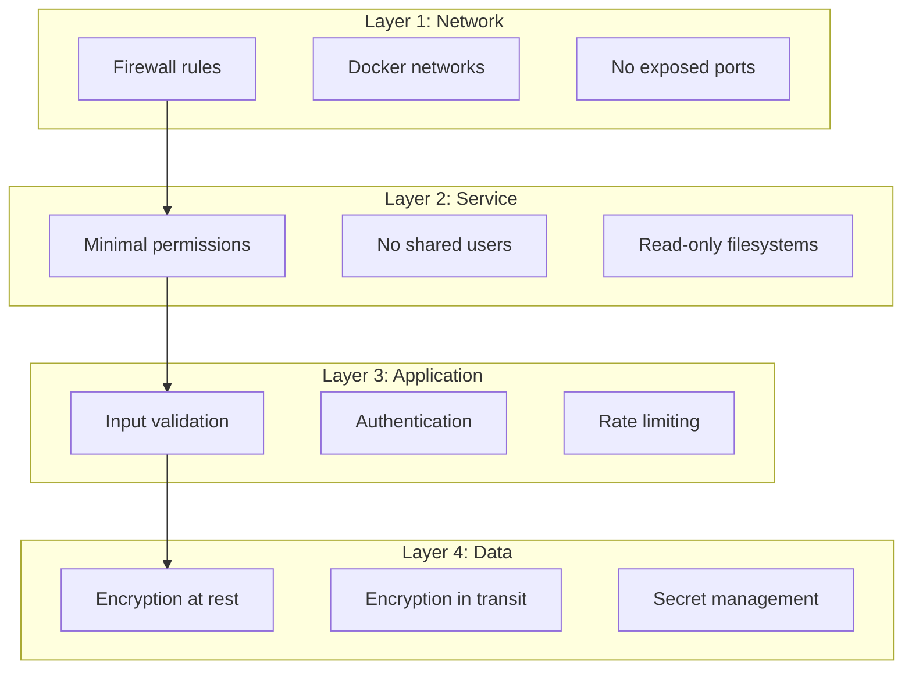

# Architecture

## Overview

dotslashstream is a self-hosted media streaming service with four core services. API Gateway is the single entry point — all other services are network isolated.

## Design Principles

1. **Single entry point** — Only API Gateway exposes ports to the network
2. **Network isolation** — Workers and search gateway have no internet access
3. **Service isolation** — Compromised service can't affect others
4. **Stream first** — Media plays as soon as initial buffer is ready
5. **Save optionally** — Users choose whether to archive content
6. **Object storage** — All media stored in S3-compatible buckets
7. **Liability isolation** — Indexer configs live on separate gateway
8. **Flexible input** — Content via search or manual magnet/torrent links

## System Diagram



## Network Isolation

### Exposed Services (DMZ)

| Service | Ports | Protocol | Purpose |
|---------|-------|----------|---------|
| API Gateway | 8000, 8443 | HTTP/HTTPS | REST API, WebSocket |
| Web App | 3000, 443 | HTTPS | Frontend UI |

### Isolated Services (Internal)

| Service | Ports | Protocol | Purpose |
|---------|-------|----------|---------|
| Torrent Worker | None | Internal only | Download, transcode |
| Search Gateway | None | Internal only | Indexer queries |

### Isolation Rules



### Docker Network Configuration

```yaml
networks:
  dmz:
    driver: bridge
    ipam:
      config:
        - subnet: 172.20.0.0/24
  
  internal:
    driver: bridge
    internal: true  # No external access
    ipam:
      config:
        - subnet: 172.21.0.0/24
  
  storage:
    driver: bridge
    internal: true
    ipam:
      config:
        - subnet: 172.22.0.0/24

services:
  api:
    networks:
      - dmz
      - internal
      - storage
  
  web:
    networks:
      - dmz
  
  worker:
    networks:
      - internal
      - storage
    # No dmz network = no internet
  
  search:
    networks:
      - internal
    # No dmz network = no internet
  
  db:
    networks:
      - storage
  
  redis:
    networks:
      - internal
      - storage
  
  minio:
    networks:
      - storage
```

## Attack Surface Reduction

### Worker Isolation



**Worker can:**
- Consume jobs from Redis
- Download torrents (via internal proxy if needed)
- Upload segments to MinIO
- Publish progress to Redis

**Worker cannot:**
- Access internet directly
- Access database
- Accept inbound connections
- Execute arbitrary code from external sources

### Search Gateway Isolation



**Search Gateway can:**
- Receive queries from API (internal network)
- Query configured indexers (outbound HTTP)
- Cache results in Redis

**Search Gateway cannot:**
- Accept connections from outside
- Access database
- Access MinIO
- Modify system configuration

## Data Flow

### Stream Request



### Search Request



## Service Responsibilities

### API Gateway (Go)

- JWT authentication
- User profiles and preferences
- Playlist management
- Job queue coordination
- WebSocket hub for real-time updates
- Rate limiting
- Request validation

### Torrent Worker (Go)

- Torrent lifecycle management
- Sequential piece delivery
- FFmpeg transcoding pipeline
- Object storage integration
- Progress reporting

### Search Gateway (Go)

- Indexer configuration management
- Parallel search across indexers
- Result normalization
- Liability isolation

## Security Layers



## Component Details

See [services.md](./services.md) for detailed service specifications.

## Storage Architecture

See [storage.md](./storage.md) for bucket structure and lifecycle.

## Streaming Pipeline

See [streaming.md](./streaming.md) for transcoding details.
