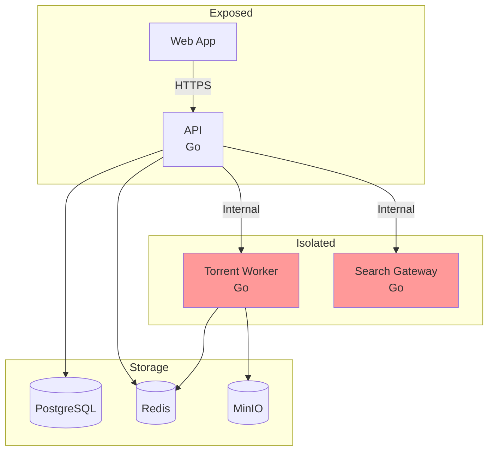

# General

System-level design documentation for dotslashstream.

## Documents

| Document | Description |
|----------|-------------|
| [architecture.md](./architecture.md) | System design, network isolation, security layers |
| [services.md](./services.md) | Service breakdown, responsibilities, tech stack |
| [streaming.md](./streaming.md) | Transcoding pipeline, HLS profiles, FFmpeg config |
| [storage.md](./storage.md) | Object storage architecture, bucket structure |

## Overview

## Design Principles

1. **Single entry point** — Only API exposes ports to the network
2. **Network isolation** — Workers and search gateway have no internet access
3. **Stream first** — Media plays as soon as initial buffer is ready
4. **Object storage** — All media stored in S3-compatible buckets
5. **Self-hosted** — Run on your own hardware
