# Streaming Pipeline

## Overview

HLS-based streaming enables playback during download. Content is transcoded on-the-fly and served as adaptive bitrate streams.

## Pipeline Architecture

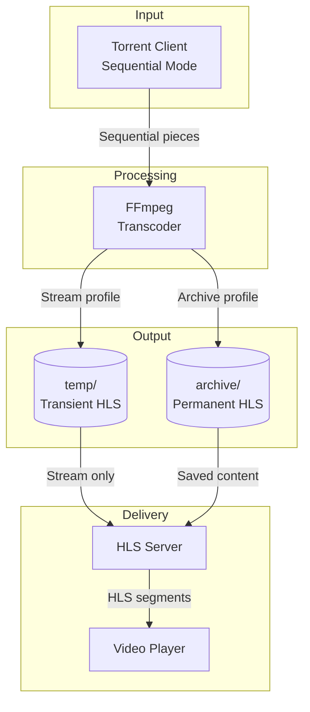

## Streaming Modes

### Stream-Only

Fast transcoding for immediate playback. Segments are temporary.

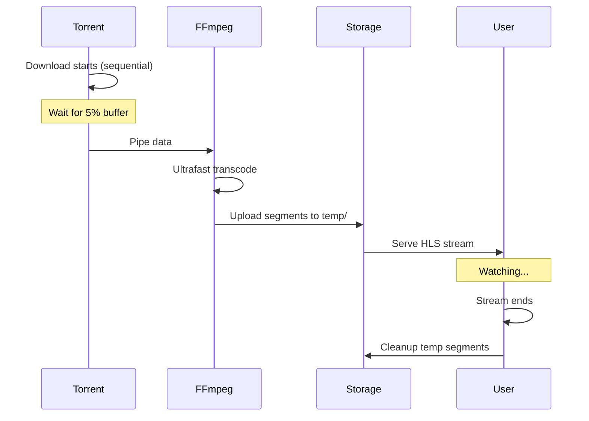

**Profile:**
```yaml
video: h264 -crf 28 -preset ultrafast
audio: aac -b:a 128k
hls_time: 4
storage: temp/
```

### Archive Mode (Two-Phase)

Stream first, archive after download completes.

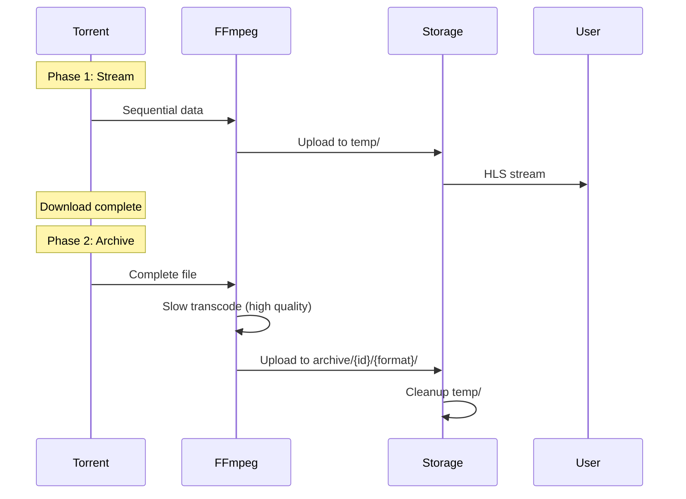

**Archive Profile (1080p):**
```yaml
video: h264 -crf 23 -preset slow -vf "scale=-2:1080"
audio: aac -b:a 192k
hls_time: 6
storage: archive/{media_id}/1080p/
```

## Transcoding Profiles

### Stream Profiles

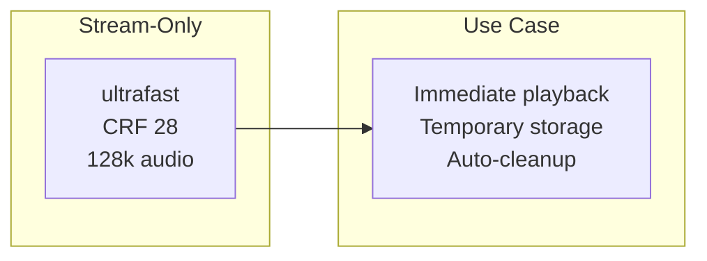

### Archive Profiles

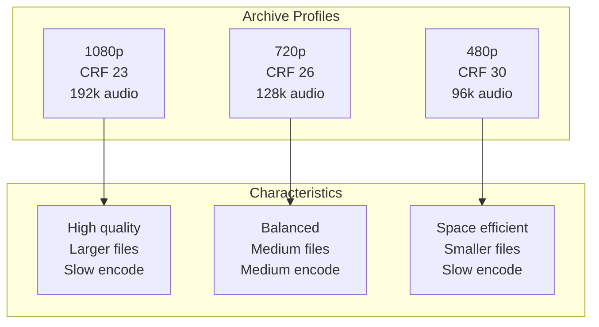

| Profile | Resolution | CRF | Preset | Audio | HLS Time |
|---------|------------|-----|--------|-------|----------|
| stream-only | Original | 28 | ultrafast | 128k | 4s |
| archive-1080p | 1920x1080 | 23 | slow | 192k | 6s |
| archive-720p | 1280x720 | 26 | slow | 128k | 6s |
| archive-480p | 854x480 | 30 | slow | 96k | 6s |

## Torrent Configuration

### Sequential Download

For streaming, pieces must be downloaded in order.

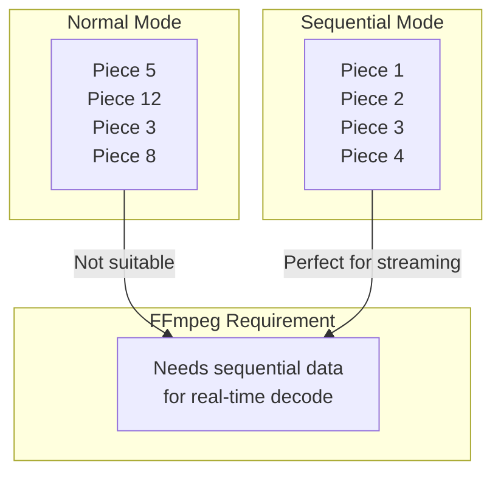

### Priority Management

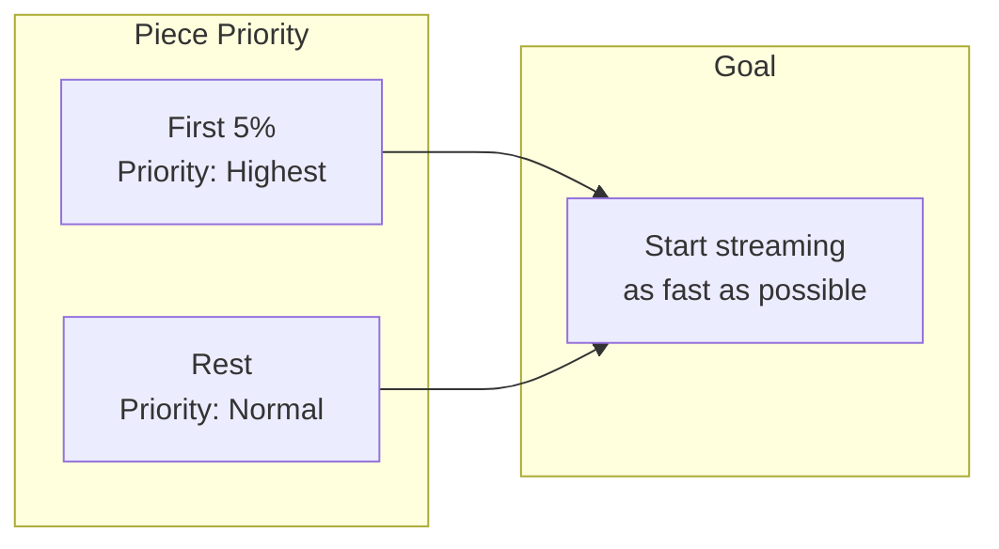

## HLS Structure

### Master Playlist

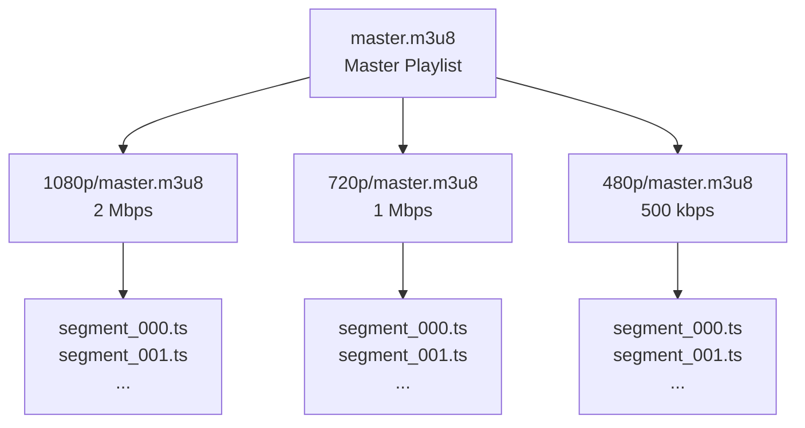

### Segment Lifecycle

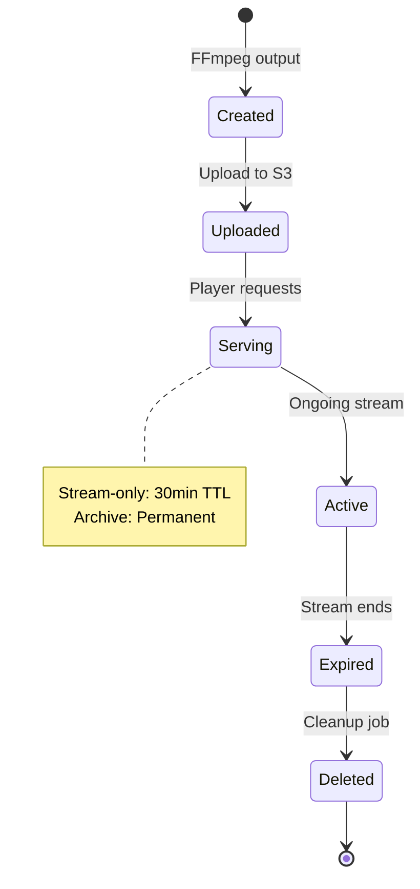

## Buffer Management

### Initial Buffer Strategy

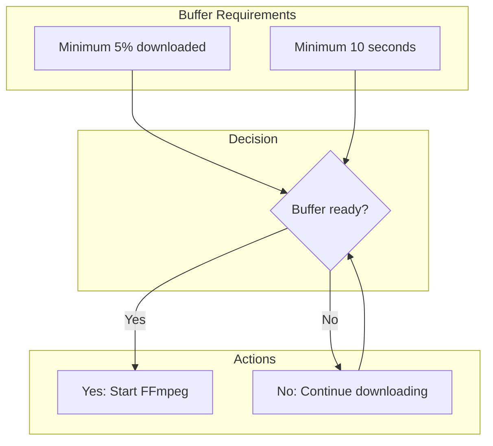

### Adaptive Buffer

```go
const (
    MinBufferPercent = 0.05  // 5% of total size
    MinBufferSeconds = 10    // minimum 10 seconds of content
)

func checkBufferReady(torrent *Torrent, mediaDuration float64) bool {
    downloadedPercent := torrent.Progress()
    downloadedSeconds := mediaDuration * downloadedPercent
    
    return downloadedPercent >= MinBufferPercent &&
           downloadedSeconds >= MinBufferSeconds
}
```

## Error Handling

### Transcoding Failures

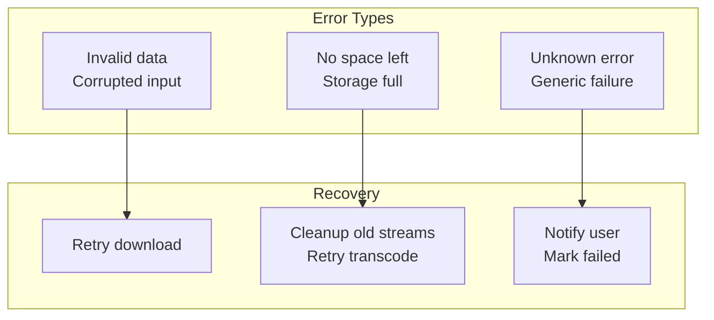

### Network Interruptions

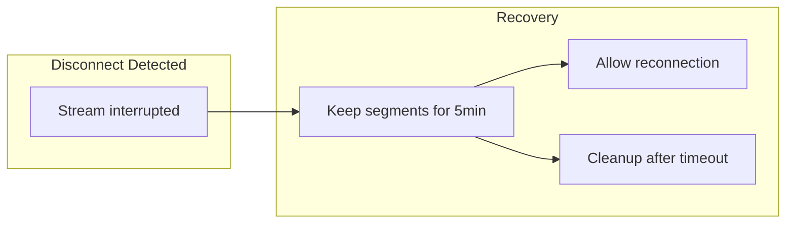

## Performance Tuning

### CPU Optimization

```yaml
# Limit FFmpeg threads per job
threads: 2

# Max concurrent transcodes
max_concurrent: 2

# GPU acceleration (if available)
hwaccel: vaapi  # or cuda, videotoolbox
```

### Memory Management

```yaml
# FFmpeg buffer size
buffer_size: 10M

# Segment memory limit
segment_buffer: 50M
```

## Monitoring Metrics

| Metric | Description | Target |
|--------|-------------|--------|
| start_to_first_segment | Time to first playable segment | < 10s |
| transcode_speed | Ratio of realtime | > 1.5x |
| segment_generation_rate | Segments per second | > 10 |
| error_rate | Failed transcodes per hour | < 1 |
