# Services

## Overview

Four containerized services. API Gateway is the only externally accessible service.

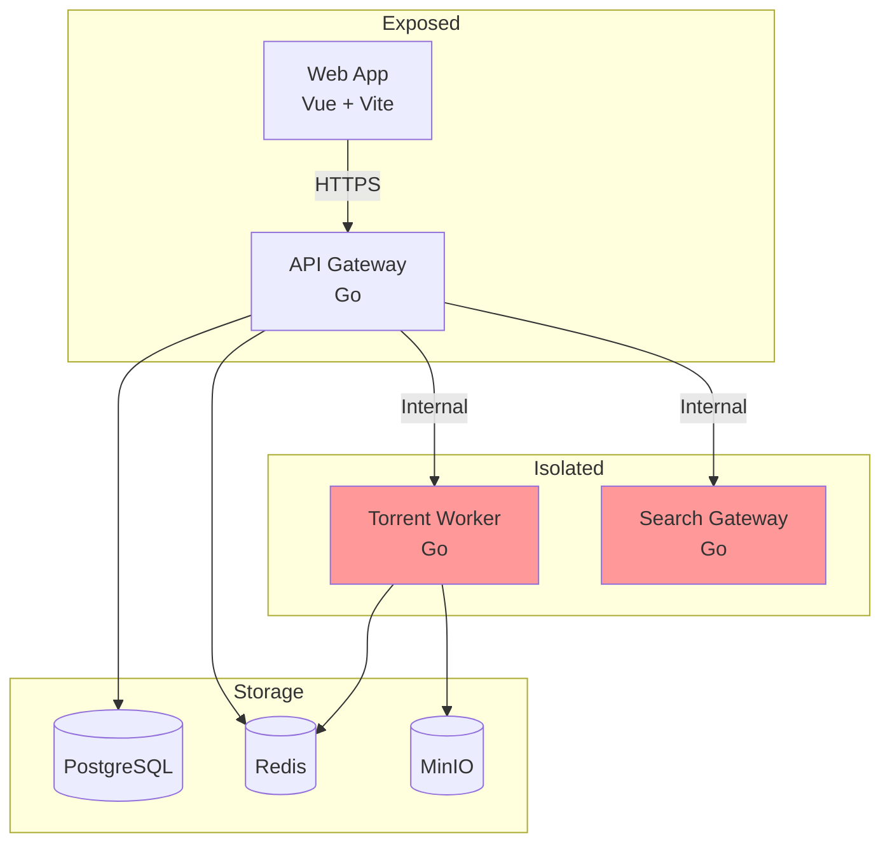

---

## API Gateway

**Purpose:** Single entry point for all client communication.

**Tech:** Go + net/http + sqlc + go-redis

### Responsibilities

- JWT authentication and sessions
- User profile CRUD
- Playlist management
- Watch history tracking
- Job queue coordination
- WebSocket connections for real-time updates
- Rate limiting (3 concurrent downloads per user)
- Request validation
- Structured logging and basic metrics

### Network Access

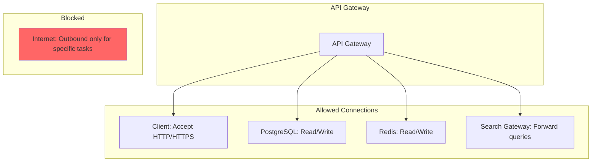

### Endpoints

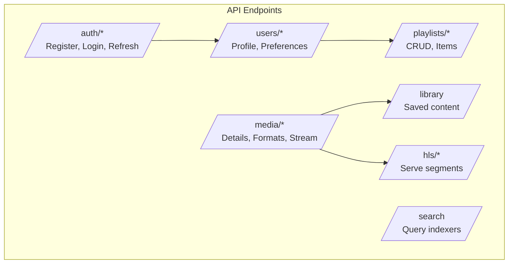

### Configuration

```yaml
DATABASE_URL: postgresql://user:pass@db:5432/torrentstream
REDIS_URL: redis://redis:6379
JWT_SECRET: your-secret-key
SEARCH_GATEWAY_URL: http://search:8000
```

### Go Project Structure

```
api/
├── cmd/
│   └── server/
│       └── main.go
├── internal/
│   ├── auth/
│   │   ├── jwt.go
│   │   └── middleware.go
│   ├── handlers/
│   │   ├── auth.go
│   │   ├── users.go
│   │   ├── playlists.go
│   │   ├── media.go
│   │   └── search.go
│   ├── models/
│   │   ├── user.go
│   │   ├── playlist.go
│   │   └── media.go
│   ├── repository/
│   │   ├── user.go
│   │   ├── playlist.go
│   │   └── media.go
│   ├── service/
│   │   ├── auth.go
│   │   ├── user.go
│   │   ├── playlist.go
│   │   └── media.go
│   └── websocket/
│       └── hub.go
├── migrations/
├── go.mod
└── go.sum
```

---

## Torrent Worker

**Purpose:** Download torrents and transcode to HLS streams.

**Tech:** Go + anacrolix/torrent + ffmpeg bindings

### Network Access

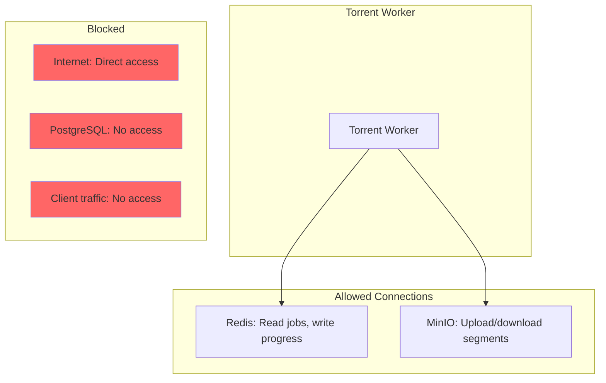

### Responsibilities

- Torrent lifecycle management
- Sequential piece delivery for streaming
- FFmpeg transcoding to HLS
- Object storage upload/download
- Progress reporting via Redis
- Health check heartbeats
- Structured logging

### Job Types

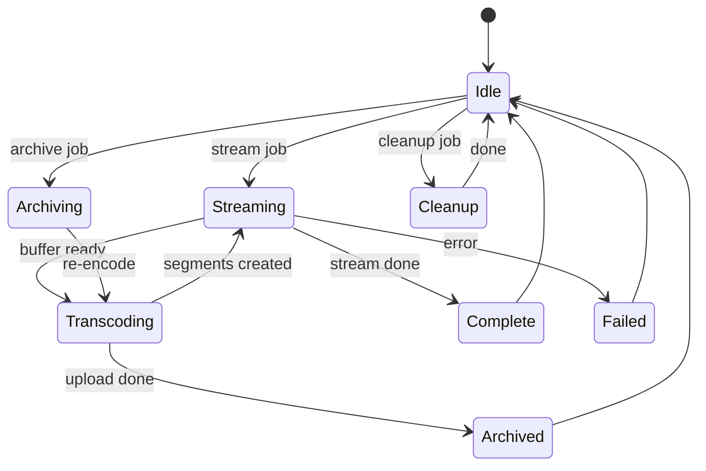

### Transcoding Profiles

| Profile | Preset | CRF | Use Case |
|---------|--------|-----|----------|
| stream-only | ultrafast | 28 | Immediate playback |
| archive-1080p | slow | 23 | Permanent storage |
| archive-720p | slow | 26 | Balanced quality |
| archive-480p | slow | 30 | Space efficient |

### Configuration

```yaml
REDIS_URL: redis://redis:6379
MINIO_ENDPOINT: minio:9000
MINIO_BUCKET: media
MAX_ACTIVE_DOWNLOADS: 5
SEED_RATIO: 1.5
SEED_TIME: 3600
```

### Go Project Structure

```
worker/
├── cmd/
│   └── worker/
│       └── main.go
├── internal/
│   ├── torrent/
│   │   ├── client.go
│   │   ├── download.go
│   │   └── sequential.go
│   ├── transcode/
│   │   ├── ffmpeg.go
│   │   ├── profiles.go
│   │   └── hls.go
│   ├── storage/
│   │   └── minio.go
│   ├── queue/
│   │   └── asynq.go
│   └── models/
│       ├── job.go
│       └── progress.go
├── go.mod
└── go.sum
```

---

## Search Gateway

**Purpose:** Isolated service for indexer configuration and search.

**Tech:** Go + Colly (scraping) + go-redis

### Network Access

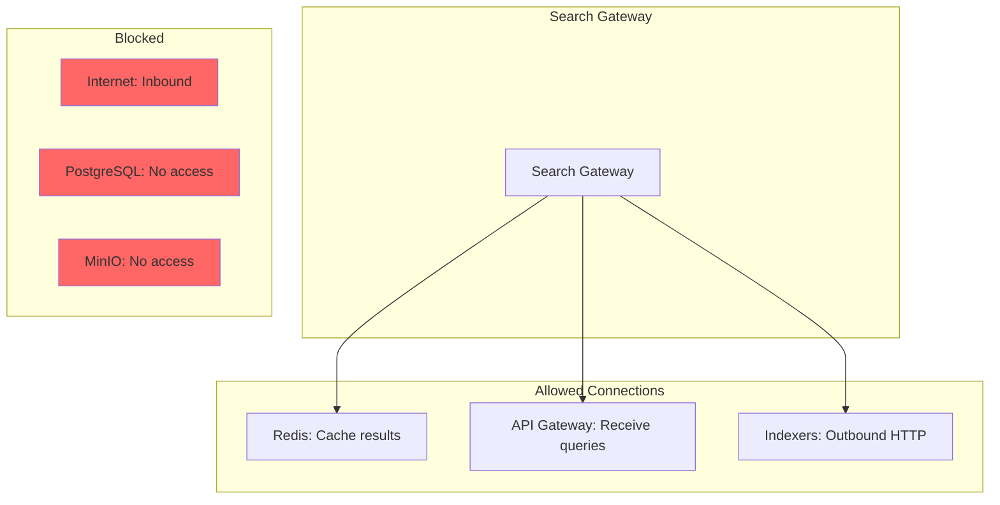

### Indexer Types

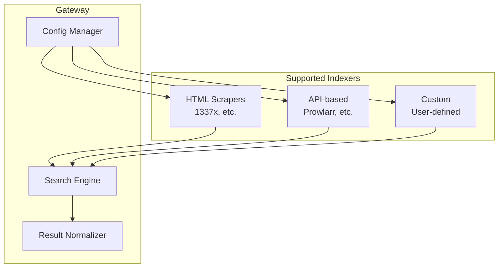

### Indexer Config Format

```json
{
  "indexers": [
    {
      "name": "1337x",
      "url": "https://1337x.to",
      "type": "html",
      "search_path": "/search/{query}/1/",
      "selectors": {
        "title": "td.name a:last-child",
        "url": "td.name a:last-child@href",
        "seeds": "td.seeds",
        "size": "td.size"
      }
    }
  ]
}
```

### Configuration

```yaml
CONFIG_PATH: /config/indexers.json
API_KEY: optional-api-key
REQUEST_TIMEOUT: 10
MAX_CONCURRENT: 5
```

### Go Project Structure

```
search/
├── cmd/
│   └── gateway/
│       └── main.go
├── internal/
│   ├── indexers/
│   │   ├── manager.go
│   │   ├── html.go
│   │   └── api.go
│   ├── search/
│   │   ├── engine.go
│   │   └── normalize.go
│   ├── cache/
│   │   └── redis.go
│   └── models/
│       ├── indexer.go
│       └── result.go
├── configs/
│   └── indexers.json
├── go.mod
└── go.sum
```

---

## Web Frontend

**Purpose:** User interface for the streaming service.

**Tech:** Vue + Vite + Tailwind + HLS.js

### Network Access

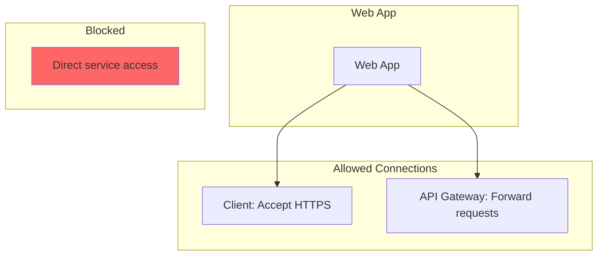

### Components

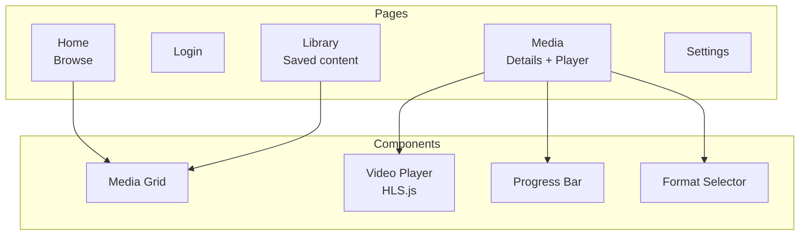

### Configuration

```yaml
NEXT_PUBLIC_API_URL: http://localhost:8000
NEXT_PUBLIC_WS_URL: ws://localhost:8000/ws
```

---

## Inter-Service Communication

### Task Queue (Asynq)

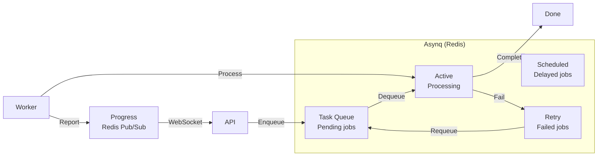

### Internal HTTP (API → Search)

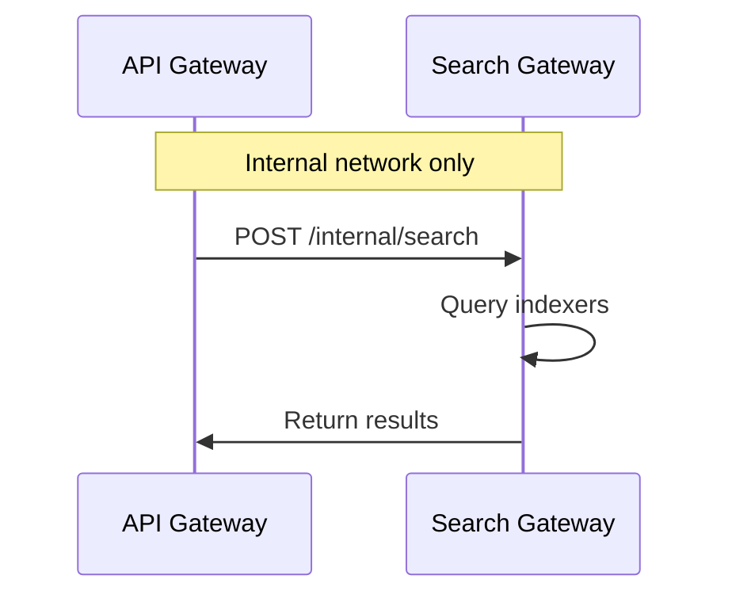

### Asynq Task Types

```go
// Task types
const (
    TaskStream      = "stream:process"
    TaskArchive     = "archive:process"
    TaskCleanup     = "cleanup:segments"
    TaskHealthCheck = "worker:heartbeat"
)

// Task payload
type StreamTask struct {
    MediaID string
    UserID  string
    Save    bool
    Format  string // 1080p, 720p, 480p
}

// Enqueue example
client := asynq.NewClient(asynq.RedisClientOpt{Addr: "redis:6379"})
info, _ := client.Enqueue(
    asynq.NewTask(TaskStream, payload),
    asynq.Queue("streaming"),
    asynq.MaxRetry(3),
    asynq.Timeout(24*time.Hour),
)
```

### WebSocket Events

| Event | Direction | Data |
|-------|-----------|------|
| stream:progress | Server → Client | progress, speed, eta |
| stream:complete | Server → Client | hls_url, format |
| stream:error | Server → Client | error, recoverable |
| stream:buffering | Server → Client | progress, estimated_start |

### Asynq Monitor

Asynq provides a web UI for monitoring tasks:

```go
// In API gateway
mux.Handle("/asynq", asynqmonitor.NewHandler(monitorOpts))
```

Accessible at: `http://localhost:8000/asynq`

---

## Scaling Considerations

### Current Target (Self-Hosted)

- All services on one machine
- Docker Compose orchestration
- Single worker instance

### Future Growth

- Multiple worker instances
- Managed database
- Distributed MinIO
- Load balancer (if needed)
