# Storage Architecture

## Overview

All media storage uses S3-compatible object storage (MinIO). Only API Gateway and Torrent Worker have access.

## Bucket Structure

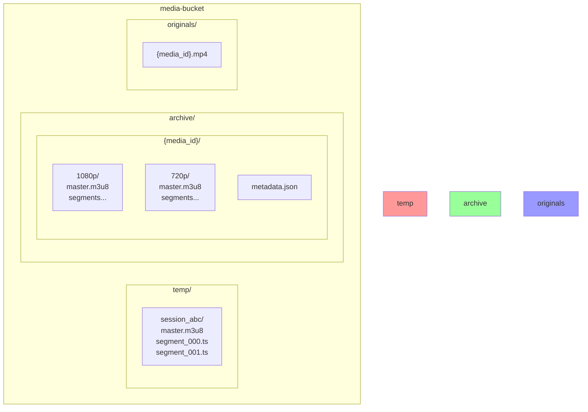

## Storage Access

### Who Can Access

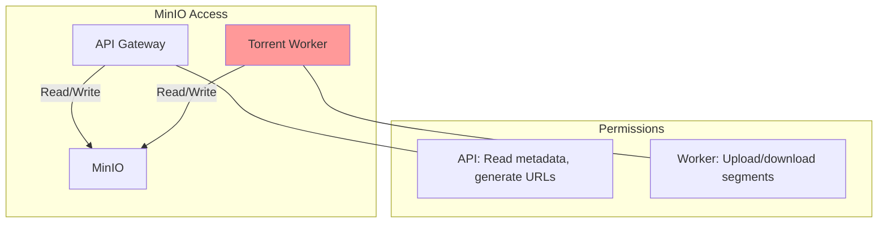

### Isolation Rules

| Service | Access | Operations |
|---------|--------|------------|
| API Gateway | ✅ | Read metadata, generate presigned URLs |
| Torrent Worker | ✅ | Upload segments, download for re-transcode |
| Search Gateway | ❌ | No access |
| Web App | ❌ | No direct access (via API only) |

## Storage Classes

### Temporary (`temp/`)

**Purpose:** HLS segments for active streams

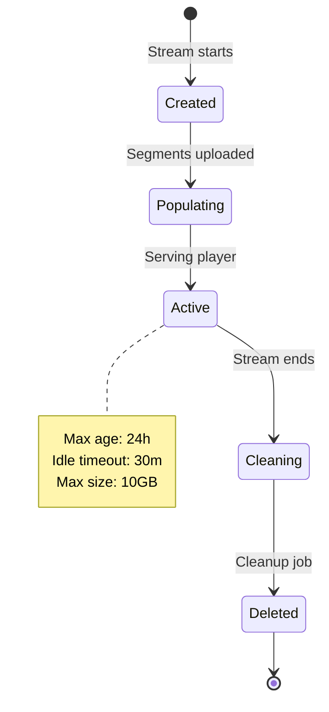

### Archive (`archive/`)

**Purpose:** Permanent media library

**Movie Structure:**
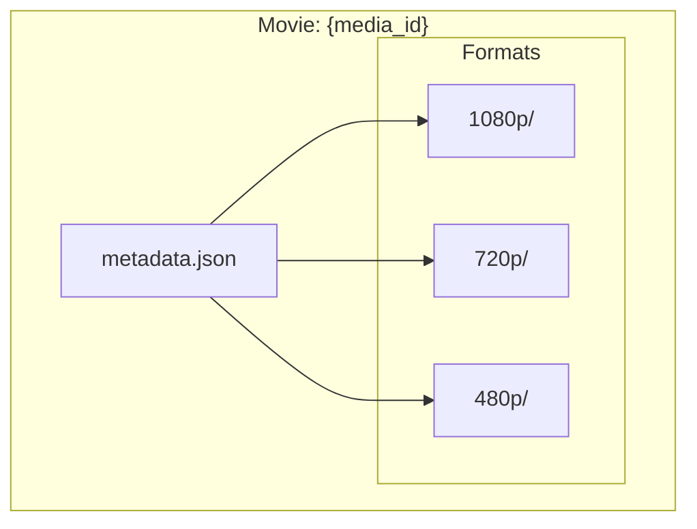

**TV Show Structure:**
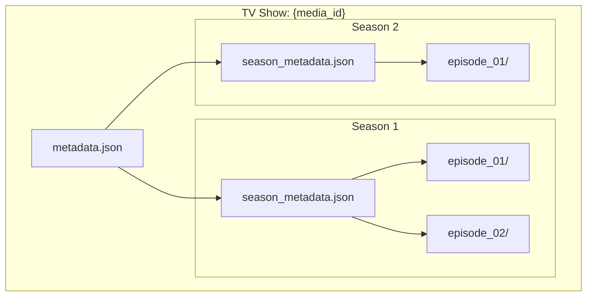

**Metadata Example (Movie):**
```json
{
  "media_id": "abc123",
  "type": "movie",
  "title": "Movie Title",
  "year": 2024,
  "formats": {
    "1080p": { "path": "1080p/", "size": 2147483648, "duration": 7200 },
    "720p": { "path": "720p/", "size": 1073741824, "duration": 7200 }
  }
}
```

**Metadata Example (TV Show):**
```json
{
  "media_id": "xyz789",
  "type": "tv",
  "title": "Show Title",
  "seasons": [
    {
      "number": 1,
      "episodes": [
        { "number": 1, "title": "Pilot", "formats": { "1080p": {}, "720p": {} } },
        { "number": 2, "title": "Episode 2", "formats": { "1080p": {} } }
      ]
    }
  ]
}
```

### Originals (`originals/`)

**Purpose:** Keep source files (optional)

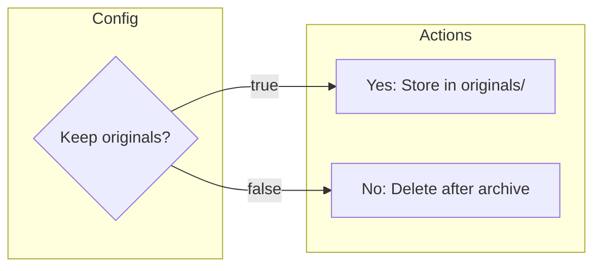

## MinIO Configuration

### Docker Setup

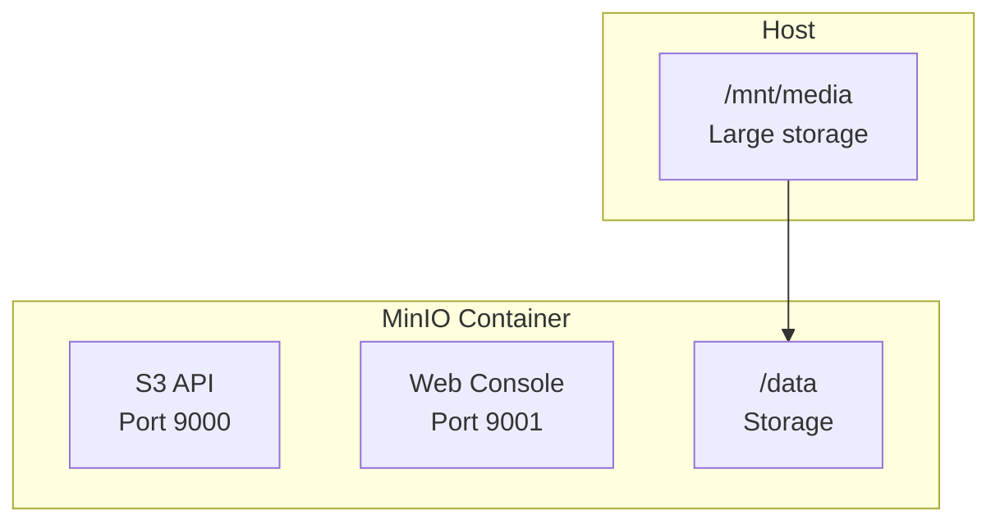

### Network Access

```yaml
networks:
  storage:
    driver: bridge
    internal: true  # No external access

services:
  minio:
    networks:
      - storage
    # Only API and Worker can reach this
```

### Environment

```yaml
MINIO_ROOT_USER: admin
MINIO_ROOT_PASSWORD: secure-password
MINIO_BUCKET: media
MINIO_ENDPOINT: minio:9000
MINIO_ACCESS_KEY: admin
MINIO_SECRET_KEY: secure-password
```

## S3 Client Operations

### Core Operations

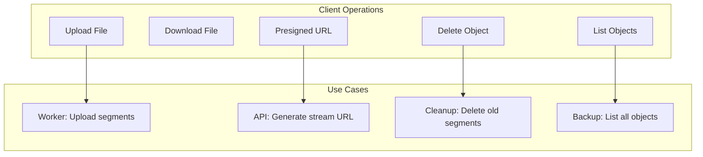

### Presigned URLs

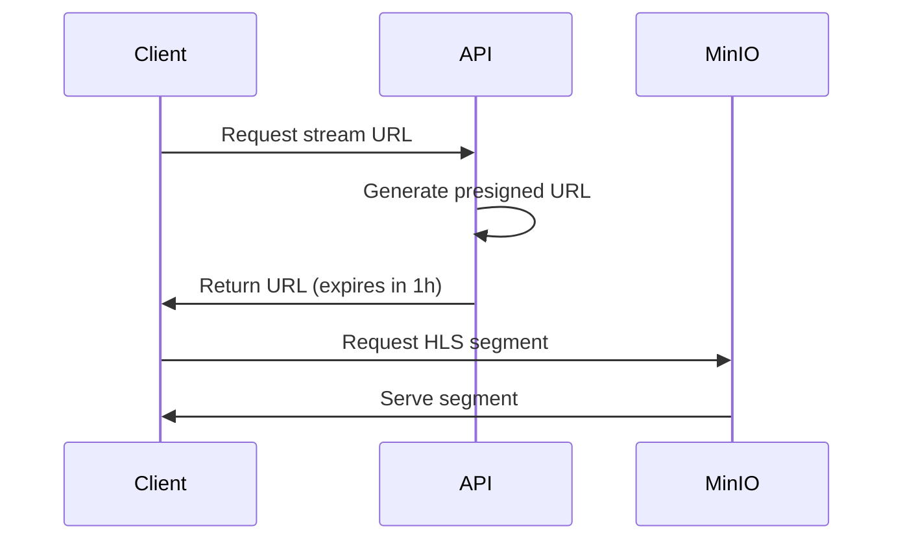

### Go Client

```go
package storage

import (
    "context"
    "github.com/minio/minio-go/v7"
)

type MinIOClient struct {
    client *minio.Client
    bucket string
}

func NewMinIOClient(endpoint, accessKey, secretKey, bucket string) (*MinIOClient, error) {
    client, err := minio.New(endpoint, &minio.Options{
        Creds:  credentials.NewStaticV4(accessKey, secretKey, ""),
        Secure: false,
    })
    if err != nil {
        return nil, err
    }
    
    return &MinIOClient{
        client: client,
        bucket: bucket,
    }, nil
}

func (m *MinIOClient) UploadSegment(ctx context.Context, key string, reader io.Reader, size int64) error {
    _, err := m.client.PutObject(ctx, m.bucket, key, reader, size, minio.PutObjectOptions{
        ContentType: "video/mp2t",
    })
    return err
}

func (m *MinIOClient) GetPresignedURL(ctx context.Context, key string, expiry time.Duration) (string, error) {
    reqParams := url.Values{}
    presignedURL, err := m.client.PresignedGetObject(ctx, m.bucket, key, expiry, reqParams)
    if err != nil {
        return "", err
    }
    return presignedURL.String(), nil
}
```

## Storage Lifecycle

### Automatic Cleanup

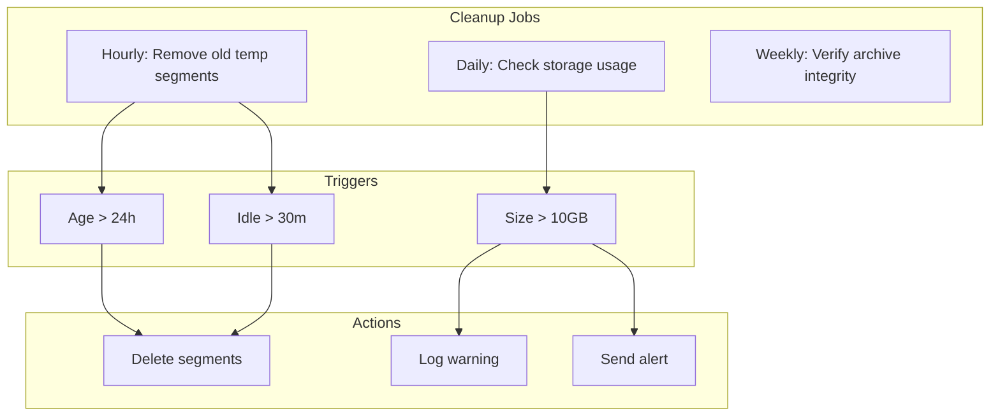

### Manual Cleanup

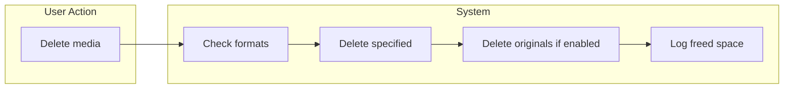

## Backup Strategy

### Backup Flow

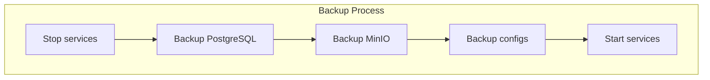

### Restore Flow

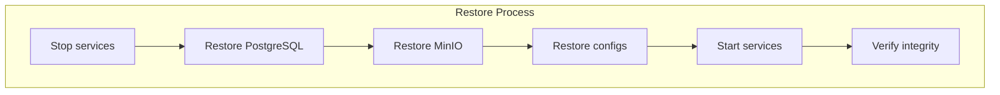

## Migration to Cloud S3

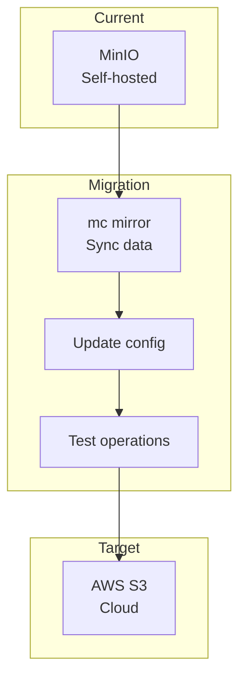

**Steps:**
1. Update environment variables
2. Sync data: `mc mirror media-bucket/ s3/media-bucket/`
3. Update application configuration
4. Test all operations
5. Decommission MinIO

## Storage Monitoring

### Key Metrics

| Metric | Description | Alert Threshold |
|--------|-------------|-----------------|
| bucket_size_total | Total bytes in bucket | > 500GB |
| bucket_size_temp | Temp storage usage | > 10GB |
| object_count | Number of objects | > 10000 |
| upload_bandwidth | Upload speed | < 10MB/s |
| download_bandwidth | Download speed | < 50MB/s |
| error_rate | Failed requests | > 1% |

### Health Check

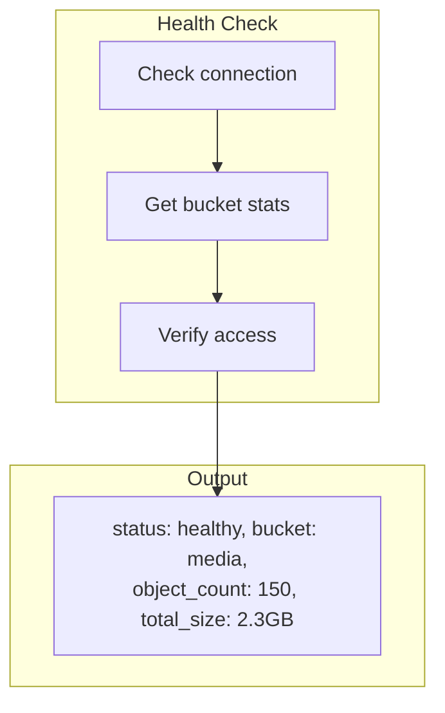
