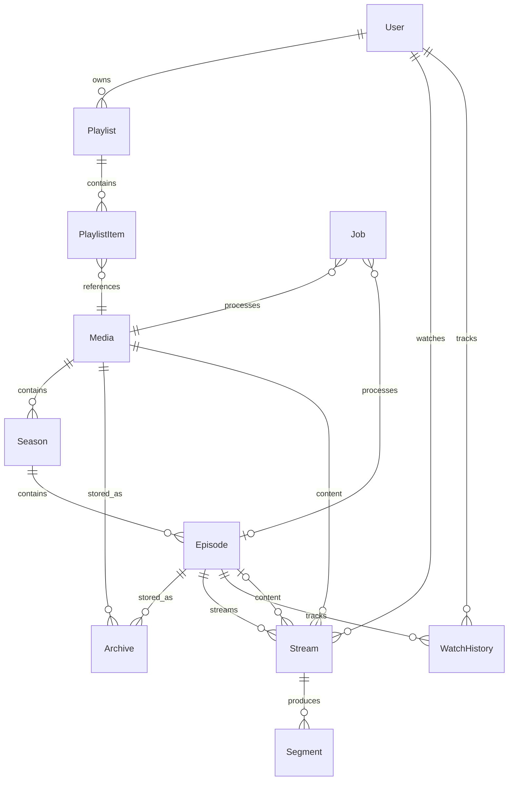

# Data Model: dotslashstream Core Platform

**Branch**: `001-streaming-platform` | **Date**: 2024-01-18  
**Feature**: dotslashstream Core Platform

## Entities

### User

Represents a system user with authentication and preferences.

| Field | Type | Constraints | Description |
|-------|------|-------------|-------------|
| id | UUID | PK | Unique identifier |
| email | VARCHAR(255) | UNIQUE, NOT NULL | Login email |
| password_hash | VARCHAR(255) | NOT NULL | Bcrypt hashed password |
| created_at | TIMESTAMP | NOT NULL | Account creation time |
| updated_at | TIMESTAMP | NOT NULL | Last profile update |
| preferences | JSONB | DEFAULT '{}' | User settings |

**Preferences Schema**:
```json
{
  "default_format": "1080p",
  "auto_save": false,
  "keep_originals": false
}
```

### Media

Represents a movie or TV show with metadata.

| Field | Type | Constraints | Description |
|-------|------|-------------|-------------|
| id | UUID | PK | Unique identifier |
| type | ENUM | NOT NULL | 'movie' or 'tv' |
| title | VARCHAR(500) | NOT NULL | Display title |
| year | INTEGER | | Release year |
| poster_url | TEXT | | Poster image URL |
| backdrop_url | TEXT | | Backdrop image URL |
| plot | TEXT | | Description |
| torrent_url | TEXT | NOT NULL | Magnet link or torrent URL |
| created_at | TIMESTAMP | NOT NULL | First indexed time |
| metadata | JSONB | DEFAULT '{}' | Additional metadata |

### Season

Groups episodes for TV shows.

| Field | Type | Constraints | Description |
|-------|------|-------------|-------------|
| id | UUID | PK | Unique identifier |
| media_id | UUID | FK, NOT NULL | Parent TV show |
| number | INTEGER | NOT NULL | Season number |
| title | VARCHAR(255) | | Season name |
| created_at | TIMESTAMP | NOT NULL | Creation time |

**Unique Constraint**: (media_id, number)

### Episode

Individual TV show installment.

| Field | Type | Constraints | Description |
|-------|------|-------------|-------------|
| id | UUID | PK | Unique identifier |
| season_id | UUID | FK, NOT NULL | Parent season |
| number | INTEGER | NOT NULL | Episode number |
| title | VARCHAR(255) | | Episode title |
| torrent_url | TEXT | NOT NULL | Magnet link or torrent URL |
| duration | INTEGER | | Runtime in seconds |
| created_at | TIMESTAMP | NOT NULL | Creation time |

**Unique Constraint**: (season_id, number)

### Playlist

Named collection of media items.

| Field | Type | Constraints | Description |
|-------|------|-------------|-------------|
| id | UUID | PK | Unique identifier |
| user_id | UUID | FK, NOT NULL | Owner |
| name | VARCHAR(255) | NOT NULL | Playlist name |
| created_at | TIMESTAMP | NOT NULL | Creation time |
| updated_at | TIMESTAMP | NOT NULL | Last modification |

### PlaylistItem

Media item within a playlist.

| Field | Type | Constraints | Description |
|-------|------|-------------|-------------|
| id | UUID | PK | Unique identifier |
| playlist_id | UUID | FK, NOT NULL | Parent playlist |
| media_id | UUID | FK, NOT NULL | Media item |
| episode_id | UUID | FK | Specific episode (TV only) |
| position | INTEGER | NOT NULL | Sort order |
| added_at | TIMESTAMP | NOT NULL | When added |

### Stream

Active streaming session.

| Field | Type | Constraints | Description |
|-------|------|-------------|-------------|
| id | UUID | PK | Unique identifier |
| user_id | UUID | FK, NOT NULL | Viewer |
| media_id | UUID | FK, NOT NULL | Content being streamed |
| episode_id | UUID | FK | Specific episode (TV only) |
| status | ENUM | NOT NULL | buffering/streaming/completed/failed |
| progress | DECIMAL(5,2) | DEFAULT 0 | Download progress (0-100) |
| hls_url | TEXT | | Generated HLS playlist URL |
| created_at | TIMESTAMP | NOT NULL | Stream start |
| updated_at | TIMESTAMP | NOT NULL | Last status update |

### Archive

Permanently saved media in specific format.

| Field | Type | Constraints | Description |
|-------|------|-------------|-------------|
| id | UUID | PK | Unique identifier |
| media_id | UUID | FK | Movie reference |
| episode_id | UUID | FK | Episode reference |
| format | ENUM | NOT NULL | '1080p', '720p', '480p' |
| path | TEXT | NOT NULL | S3 bucket path |
| size | BIGINT | NOT NULL | File size in bytes |
| duration | INTEGER | | Runtime in seconds |
| created_at | TIMESTAMP | NOT NULL | Archive completion |

**Unique Constraint**: (media_id, format) or (episode_id, format)

### WatchHistory

Tracks user playback position.

| Field | Type | Constraints | Description |
|-------|------|-------------|-------------|
| id | UUID | PK | Unique identifier |
| user_id | UUID | FK, NOT NULL | Viewer |
| media_id | UUID | FK | Movie reference |
| episode_id | UUID | FK | Episode reference |
| position | INTEGER | NOT NULL | Playback position (seconds) |
| completed | BOOLEAN | DEFAULT false | Finished watching |
| watched_at | TIMESTAMP | NOT NULL | Last watched |

### Indexer

External search source configuration.

| Field | Type | Constraints | Description |
|-------|------|-------------|-------------|
| id | UUID | PK | Unique identifier |
| name | VARCHAR(255) | UNIQUE, NOT NULL | Display name |
| type | ENUM | NOT NULL | 'html' or 'api' |
| url | TEXT | NOT NULL | Base URL |
| search_path | TEXT | | URL pattern with {query} |
| selectors | JSONB | | HTML selectors (type=html) |
| api_key | TEXT | | API key (type=api) |
| enabled | BOOLEAN | DEFAULT true | Active status |
| created_at | TIMESTAMP | NOT NULL | Creation time |

### Job

Background task tracking.

| Field | Type | Constraints | Description |
|-------|------|-------------|-------------|
| id | UUID | PK | Unique identifier |
| type | ENUM | NOT NULL | stream/archive/cleanup |
| status | ENUM | NOT NULL | pending/processing/completed/failed |
| media_id | UUID | FK | Related media |
| user_id | UUID | FK | Requesting user |
| payload | JSONB | NOT NULL | Task parameters |
| result | JSONB | | Task output |
| error | TEXT | | Error message if failed |
| created_at | TIMESTAMP | NOT NULL | Queue time |
| started_at | TIMESTAMP | | Processing start |
| completed_at | TIMESTAMP | | Completion time |

### Segment

HLS segment metadata (actual files in MinIO).

| Field | Type | Constraints | Description |
|-------|------|-------------|-------------|
| id | UUID | PK | Unique identifier |
| stream_id | UUID | FK | Parent stream |
| sequence | INTEGER | NOT NULL | Segment order |
| duration | DECIMAL(4,2) | NOT NULL | Segment length (seconds) |
| size | INTEGER | NOT NULL | File size in bytes |
| path | TEXT | NOT NULL | S3 bucket path |
| created_at | TIMESTAMP | NOT NULL | Generation time |

## Relationships



## State Transitions

### Stream Status

```
buffering → streaming → completed
    ↓           ↓
  failed      failed
```

### Job Status

```
pending → processing → completed
    ↓          ↓
  failed     failed
```

### Archive Lifecycle (Storage)

```
temp/ (transient) → archive/ (permanent)
        ↓
    deleted
```

## Indexes

```sql
-- Performance indexes
CREATE INDEX idx_media_type ON media(type);
CREATE INDEX idx_media_title ON media USING gin(title gin_trgm_ops);
CREATE INDEX idx_season_media ON season(media_id);
CREATE INDEX idx_episode_season ON episode(season_id);
CREATE INDEX idx_playlist_user ON playlist(user_id);
CREATE INDEX idx_stream_user ON stream(user_id);
CREATE INDEX idx_stream_status ON stream(status);
CREATE INDEX idx_watch_history_user ON watch_history(user_id);
CREATE INDEX idx_watch_history_media ON watch_history(media_id);
CREATE INDEX idx_archive_media ON archive(media_id);
CREATE INDEX idx_archive_episode ON archive(episode_id);
CREATE INDEX idx_job_status ON job(status);
CREATE INDEX idx_job_type ON job(type);
CREATE INDEX idx_segment_stream ON segment(stream_id);
```

## Validation Rules

| Entity | Rule |
|--------|------|
| User | Email must be valid format |
| User | Password minimum 8 characters |
| Media | torrent_url must be valid magnet or HTTP URL |
| Episode | number must be positive integer |
| PlaylistItem | position must be unique within playlist |
| Stream | progress must be 0-100 |
| Archive | format must be 1080p, 720p, or 480p |
| Job | type must be stream, archive, or cleanup |
